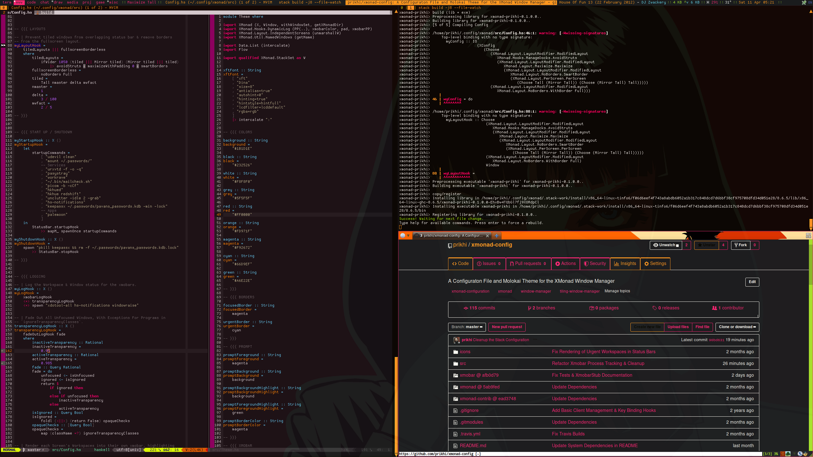

# My xmonad Configuration

I really like awesome but would love to write configs in haskell instead of
lua.

You should also install:

* `libxpm` - status bar icons
* `trayer` - system tray
* `mpc` - control MPD
* `scrot` - screenshots

## Usage

* Clone this repo to somewhere like `~/.config/xmonad/`.
* In `~/.profile` set `XMONAD_CONFIG_DIR` to this folder.
* Log out & in to reload `.profile` & run `xmonad --recompile && xmonad --restart`.

While developing, you can run `stack build --file-watch`.

## TODO:

Things Awesome does that I like:

* Keyboard shortcut popup
* On click tag selection
* Multiple tag viewing, Clients on multiple tags
* Better Floating Placement when using keyboard toggle
* Floating layout
* Maximizable floating windows
    * Add custom maximize function, checks if window floating, if so adds to
      floating set(in ExtensibleState), unfloats, & maximizes. When
      un-maximized, float & re-position.
* Configure & launch hs-notifications from xmonad
* Layout icons
* MPD Widget
* Click window in taskbar to minimize/restore
* Minimize windows
* Increase / Decrease Column Count
* Jump to Urgent - make it change focused screen if necessary
* ncmpcpp dropdown  (Util.Scratchpad)
* Keep on Top keybinding
* Mod-RightMouseBtn to resize master width
* Shell Prompt below the status bar instead of overlaid on top
* Equal spacing to each window in status bar.

Extra things I want it to do:

* Quick note taking to a file   (Prompt.AppendFile)
    * Maybe different modes for different lists, eg. shopping list, notes, todo
      list
* Quick access to calculator
* Native systray & notifications
* Native randomized wallpaper changes? Or just keep using feh-bg.
* Supervise & re-start statusbar/notification threads:
    https://hackage.haskell.org/package/threads-supervisor-1.1.0.0/docs/Control-Concurrent-Supervisor-Tutorial.html
* Proper dynamic tagging + autotagging new windows
  (sometimes assigned tags get fucked in awesome)
    * Need to write custom XMonad.Prompt that will use DynamicWorkspaces
      extension to add new workspaces w/ names as expected by
      IndependentScreens extension. Not sure how to make dynamic keybindings to
      switch to newly created workspaces.
* Jump to window prompt w/ autocomplete
* Workspace-specific positioning on init
    * Gimp: Put image in center & toolbars to left & right side, all floating.
    * Audio: non-mixer & jamin stacked on left, Claudia on right
* Project-specific workspaces that open terminals and run commands
    * SESE Website: Open main term w/ server/client vim & file tabs, another
      term w/ files & server repl tabs, & third term with build script, move
      palemoon & chromium to appropriate screens.

Links to do some of that stuff:

* https://hackage.haskell.org/package/xmonad-contrib-0.13/docs/XMonad-Actions-CopyWindow.html
* https://hackage.haskell.org/package/xmonad-contrib-0.13/docs/XMonad-Hooks-Minimize.html
* https://hackage.haskell.org/package/xmonad-contrib-0.13/docs/XMonad-Layout-Maximize.html
* https://hackage.haskell.org/package/xmonad-contrib-0.13/docs/XMonad-Layout-Minimize.html
* https://hackage.haskell.org/package/xmonad-contrib-0.13/docs/XMonad-Layout-MultiColumns.html
* https://hackage.haskell.org/package/xmonad-contrib-0.13/docs/XMonad-Util-ExtensibleState.html
* https://www.stackage.org/haddock/lts-11.1/xmonad-contrib-0.13/XMonad-Actions-SpawnOn.html
* https://www.stackage.org/haddock/lts-11.1/xmonad-contrib-0.13/XMonad-Util-Paste.html
* https://www.stackage.org/haddock/lts-11.1/xmonad-contrib-0.13/XMonad-Util-Paste.html

## License

GPL-3.0
